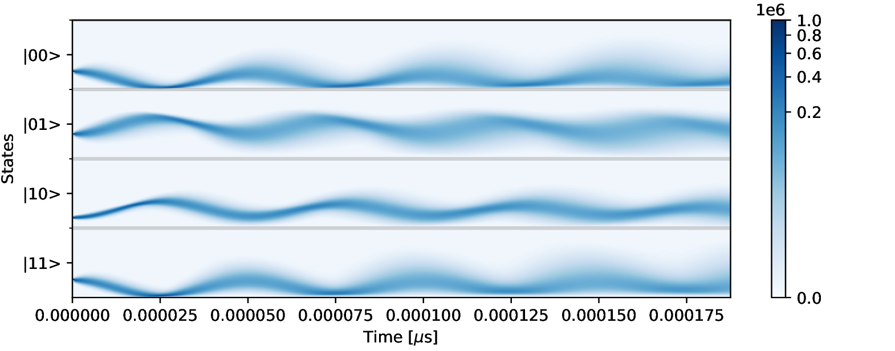

# Quantum Trajectory Simulator for Multiple Qubits in a Resonator Cavity Under Continuous Heterodyne Detection

Examples on how to set the system configuration, as well as how to extract data, can be found in [`src/main.rs`](src/main.rs).

## Requirements
* `rustc` nightly version
* `cargo`

## Usage
Building and running with optimizations enabled can be done like so:

```bash
RUSTFLAGS="-Ctarget-cpu=native -Ctarget-feature=+fma" cargo run --release
```

If double precision is required, it can be enabled like so:
```bash
RUSTFLAGS="-Ctarget-cpu=native -Ctarget-feature=+fma" cargo run --release --features "double-precision"
```

## Performance
Measurements on an i7-7700k using `perf` are as follows:


| Qubits  | GFLOP/s |
| ------- | ------- |
| 1       | 203.5   |
| 2       | 232.1   |
| 3       | 249.5   |
| 4       | 224.5   |

The actual `perf` command, output and configuration details can be found in the appendix of the thesis.
